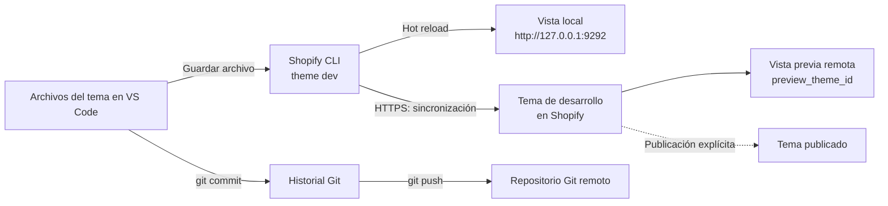

# Pruebas locales de Shopify

Fecha de preparación: 2026-08-28.

## Alcance y decisiones

Se preparó el entorno solicitado para desarrollar y validar un tema Shopify. La vista previa está conectada a `km5nsx-rj.myshopify.com` y sincroniza un tema de desarrollo; no se ha publicado el tema. La preparación inicial no cambió la configuración administrativa; posteriormente el usuario configuró español como idioma predeterminado. Necesita autenticación y conexión; no sustituye Shopify con un servidor de comercio local.

Se eligió Dawn, la base oficial sugerida en [SHOPIFY_PROJECT_GUIDELINES](../SHOPIFY_PROJECT_GUIDELINES.md). Después de validar esa base se aplicó COMMED; las diferencias y opciones del editor están en [COMMED_IMPLEMENTATION](COMMED_IMPLEMENTATION.md).

| Componente | Versión verificada |
|---|---|
| Node.js | 24.15.0 |
| npm | 11.12.1 |
| Git | 2.52.0.windows.1 |
| Shopify CLI local | 4.7.0 |
| Tema base Dawn | 16.0.0 |

Shopify CLI se instala dentro de `node_modules/`, fijado por `package.json` y `package-lock.json`. El proyecto pide Node.js 24 o superior para homogeneizar el entorno y utilizar `--use-system-ca` en los comandos npm. No necesita Docker, Ruby, un backend propio ni un bundler para esta etapa.

## Procedencia del tema

- Fuente: [Shopify/Dawn, etiqueta v16.0.0](https://github.com/Shopify/dawn/tree/v16.0.0).
- Commit: `bc39a7d2024f1e5c14c42f855bd3552b4913e204`.
- Archivos importados: siete directorios del tema, `.theme-check.yml` y [LICENSE](../LICENSE.md); 347 archivos en total. `blocks/` conserva su marcador de la estructura inicial.
- Se verificó la ausencia de colisiones antes de copiar. No se reemplazaron archivos del usuario ni el README del proyecto.
- La copia auxiliar descargada queda en `.shopify/dawn-source/`, ignorada por Git y Shopify CLI; no es necesaria para ejecutar el tema.
- Se conserva la licencia de Shopify. No asumir que equivale a una licencia MIT sin restricciones: revisar sus condiciones antes de redistribuir el tema.

## Instalar en otra máquina

Instalar Node.js 24 o superior y Git. Desde la raíz del repositorio:

```sh
npm ci
npm run shopify -- version
npm run check
```

No instalar `@shopify/theme` por separado. Los scripts utilizan la dependencia local, no una instalación global de Shopify CLI.

### Certificados de la red de trabajo

La consulta inicial a npm falló con `SELF_SIGNED_CERT_IN_CHAIN`. Se resolvió habilitando el almacén de certificados de confianza del sistema para Node; no se desactivó TLS ni se modificó la configuración global de npm.

En PowerShell, si se presenta el mismo problema:

```powershell
$env:NODE_USE_SYSTEM_CA = '1'
npm.cmd ci
```

En macOS/Linux, si la red lo requiere y el certificado corporativo ya está instalado en el sistema:

```sh
NODE_USE_SYSTEM_CA=1 npm ci
```

Los scripts del proyecto ya pasan `--use-system-ca` a Node para las operaciones de Shopify CLI. No utilizar `strict-ssl=false` ni `NODE_TLS_REJECT_UNAUTHORIZED=0`. Si el problema persiste, revisar la cadena de certificados y el proxy con el administrador de la red.

Si PowerShell bloquea `npm.ps1`, usar `npm.cmd` en lugar de `npm`; no hace falta relajar la política de ejecución.

## Validar sin iniciar sesión

```sh
npm run check
```

Theme Check realiza análisis estático; no comprueba compras, inventario real, pagos ni apariencia visual. No usar corrección automática antes de revisar el alcance de las modificaciones.

## Abrir la vista previa

Se necesita el dominio real `nombre.myshopify.com` de la tienda de desarrollo y una cuenta autorizada para trabajar con sus temas. En una Dev Store, verificar acceso como propietario o usuario de la tienda con los permisos correspondientes.

```sh
npm run dev -- --store TU-TIENDA.myshopify.com
```

Completar el inicio de sesión cuando Shopify CLI lo solicite. No guardar ni compartir contraseñas o tokens en el repositorio.

El comando sincroniza los archivos a un tema de desarrollo y muestra una URL local, normalmente `http://127.0.0.1:9292`, además del acceso al editor del tema. Usa los datos de la tienda y necesita conexión. Si existe un tema de desarrollo anterior para ese entorno, puede reemplazar su contenido: confirmar que sea un entorno de pruebas antes de ejecutar.

## Sincronización, Git y publicación

Fecha de documentación: 2026-08-29. En este proyecto, guardar código mientras `npm run dev` está activo actualiza un tema de desarrollo; no publica el tema y no depende de crear un commit.



Shopify CLI observa los archivos guardados, sincroniza el tema de desarrollo remoto y actualiza la vista local. Git mantiene el historial del código por separado. Ninguna flecha desde Git llega al tema publicado porque el repositorio no tiene configurada una integración de despliegue automático.

### Cuándo se refleja un cambio

1. Editar un archivo del tema en VS Code.
2. Guardarlo manualmente o mediante Auto Save.
3. Mantener activa la terminal que ejecuta `npm run dev -- --store km5nsx-rj.myshopify.com`.
4. Esperar a que Shopify CLI procese el archivo. CSS y secciones pueden usar hot reload; otros cambios provocan una recarga completa.
5. Revisar el resultado en `http://127.0.0.1:9292` o actualizar la vista previa remota del tema de desarrollo.

Si la terminal se detiene con `Ctrl+C`, los cambios posteriores permanecen únicamente en el sistema de archivos hasta reiniciar `theme dev` o ejecutar otra operación explícita de carga. La última versión ya sincronizada puede seguir disponible temporalmente en Shopify; los temas de desarrollo pueden eliminarse al cerrar la sesión de Shopify CLI.

### Qué hace Git

- `git add` prepara cambios para versionarlos.
- `git commit` crea un punto de historial local; no carga archivos a Shopify.
- `git push` envía commits al repositorio Git remoto; no despliega el tema en la configuración actual.
- Un cambio puede verse en la vista previa sin commit si el archivo fue guardado mientras `theme dev` estaba activo.

Git sigue siendo la práctica del proyecto para conservar trazabilidad, revisar diferencias y recuperar versiones, aunque no controle la sincronización de desarrollo.

### Qué requiere una acción explícita

| Destino | Cómo se actualiza | Alcance |
|---|---|---|
| Vista local | Guardar con `theme dev` activo | Desarrollo local con datos de Shopify |
| Tema de desarrollo | Sincronización de `theme dev` | Vista previa, no tema público |
| Repositorio Git | `git commit` y, si corresponde, `git push` | Historial del código |
| Tema no publicado estable | `shopify theme push` con un destino revisado | Tema remoto independiente de la sesión de desarrollo |
| Tema publicado | Publicación deliberada desde Shopify Admin o una operación explícita con `--publish` | Tienda visible para visitantes |

No ejecutar `theme push`, `theme publish`, `--publish`, `--live` ni `--allow-live` como parte del ciclo normal de edición. Antes de cualquier publicación, confirmar tienda, ID del tema, diferencias pendientes y respaldo del tema activo.

### Datos administrados fuera del tema

Productos, variantes, inventario, colecciones, mercados, idiomas y canales de venta se guardan en Shopify Admin. Sus cambios pueden afectar a varios temas de la misma tienda y no necesitan un commit. En cambio, Liquid, plantillas JSON, CSS, JavaScript y assets de este repositorio pertenecen al tema y siguen el flujo de Shopify CLI descrito arriba.

La sincronización inversa del editor visual no está activa en el script actual. Como `npm run dev` no incluye `--theme-editor-sync`, no asumir que un cambio hecho en el editor de Shopify se guardará en los archivos locales. Evitar modificar simultáneamente la misma configuración desde VS Code y desde el editor visual.

No usar `--allow-live`, `--theme` apuntando a un tema publicado, `theme publish` ni `theme push` como parte de este arranque. Los scripts no incluyen publicación automática. Detener la vista previa con `Ctrl+C`.

Para comprobar el contexto de tienda cuando ya exista autenticación:

```sh
npm run theme:info
```

## Evidencia de instalación inicial

- `npm install`: 26 paquetes añadidos; 27 auditados; cero vulnerabilidades reportadas en esa ejecución. npm avisó de la dependencia transitiva obsoleta `boolean@3.2.0`; no se aplicaron actualizaciones forzadas.
- `npm run shopify -- version`: 4.7.0.
- `npm run check`: 157 archivos inspeccionados; 49 advertencias en 45 archivos; sin errores. Son resultados sobre los archivos originales importados de Dawn, no una validación de diseño COMMED.
- `.theme-check.yml` conserva las reglas de Dawn: `MatchingTranslations` y `TemplateLength` deshabilitadas. No se deshabilitaron reglas adicionales para ocultar advertencias.
- `npm run dev -- --help`: comando y parámetros disponibles; no equivale a haber iniciado el servidor.
- Comparación SHA-256: los 347 archivos importados coinciden con la fuente; los 38 recursos del usuario y su marcador `.gitkeep` permanecieron intactos durante la copia.

## Estado posterior a la personalización

- Vista previa operativa en `http://127.0.0.1:9292`, conectada a `km5nsx-rj.myshopify.com`; el usuario inició el proceso en su terminal y debe mantenerlo abierto.
- Si la terminal solicita `Enter your store password`, introducir la contraseña del escaparate directamente en ese prompt. No pegarla como comando ni guardarla en archivos versionados.
- `npm test`: cinco pruebas aprobadas. `npm run check`: cero errores, 51 advertencias. Ver interpretación en [COMMED_IMPLEMENTATION](COMMED_IMPLEMENTATION.md).
- Assets de marca integrados y Montserrat servida mediante la biblioteca de fuentes de Shopify. Originales conservados; ver [ASSETS](ASSETS.md).
- Idioma (2026-08-28): español publicado y predeterminado según captura de Shopify Admin. Verificados `lang="es"`, diálogo de búsqueda y carrito vacío en local, sin modificar traducciones del tema. Pendiente revisar el aviso de asignación de español al mercado México y validar checkout; ver [COMMED_IMPLEMENTATION](COMMED_IMPLEMENTATION.md).
- Pendiente: catálogo médico real, colecciones, contenido comercial y pruebas completas de compra. No se han creado productos ni realizado pedidos.

## Referencias oficiales

- [Requisitos de Shopify CLI](https://shopify.dev/docs/api/shopify-cli#requirements).
- [Comando theme dev y efectos sobre el tema de desarrollo](https://shopify.dev/docs/api/shopify-cli/theme/theme-dev).
- [Comando theme push y publicación explícita](https://shopify.dev/docs/api/shopify-cli/theme/theme-push).
- [Autenticación de Shopify CLI](https://shopify.dev/docs/storefronts/themes/tools/cli#authentication).
